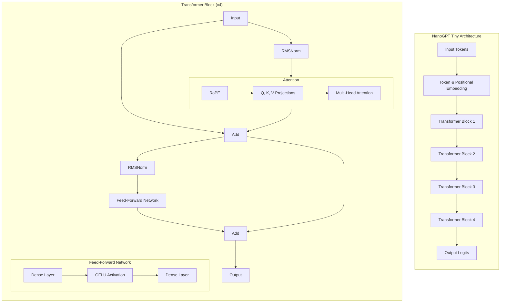

# Transformer Evolution

A toolkit for defining, evolving, and evaluating Transformer-family architectures using a flexible Domain-Specific Language (DSL).

This project lets you explore the architectural search space through evolutionary algorithms, surfacing high-quality designs by mutating, crossing over, and evaluating candidates automatically.


## Key Features

- **Flexible DSL:** Define a wide range of Transformer-family architectures in a single, typed, and validated DSL.
- **Powerful Search Drivers:** Utilizes a combination of ASHA (for breadth), PDH (for depth), and novelty-aware evolutionary algorithms.
- **Advanced Mutations:** Supports both simple hyperparameter tuning and radical, macro-level architectural changes.
- **Rich Outputs:** Generates YAML snapshots, performance metrics, and lineage visualizations for each run.
- **Reproducible Results:** Track every candidate and its ancestry, ensuring full transparency and reproducibility.

---

## Getting Started

### 1. Prerequisites

- Python 3.10+

### 2. Installation

Create a virtual environment and install the required dependencies.

```bash
python3 -m venv .venv
source .venv/bin/activate
pip install -r requirements.txt -r requirements-dev.txt
```

### 3. Run a Quick Test

Verify your setup by running the smoke tests.

```bash
make test
```

### 4. Run a Sample Evolution

Start a small-scale evolutionary search. This command seeds the initial population from the example configurations and runs for a few generations.

```bash
PYTHONPATH=src python runners/run_evolution.py \
  configs examples \
  --output results/evolution_explore_quick \
  --generations 10 --population 12 --top-k 4 --immigrants 4 \
  --device mps --seq-len 192 --batch-size 6 \
  --asha-min 40 --asha-max 160 --asha-reduction 2
```

---

## Usage

### Running Experiments

- **Evolutionary Search:** The primary method for discovering new architectures.
  ```bash
  PYTHONPATH=src python runners/run_evolution.py <seed_dirs...> [options]
  ```
- **Full Sweep (ASHA → PDH):** Evaluate a fixed set of configurations.
  ```bash
  PYTHONPATH=src python runners/run_experiment.py <config_files...> [options]
  ```
- **Validate a Config:** Check a single architecture file for correctness.
  ```bash
  PYTHONPATH=src python runners/validate.py --cfg examples/plain.yaml
  ```
- **Micro-Train a Config:** Train a tiny model for a few steps.
  ```bash
  PYTHONPATH=src python runners/train_tiny.py --cfg examples/nanogpt_tiny.yaml --steps 20
  ```

### Run Recipes

- **Explore (Wild Structure Changes):** Use a high probability of macro-mutations and more immigrants to diversify the population.
  ```bash
  --macro-prob 0.6 --immigrants 5
  ```
- **Exploit (Refine Winners):** Lower the mutation probability and focus on the top-performing candidates.
  ```bash
  --macro-prob 0.15 --top-k 8
  ```
  
Tip: `make help` lists useful maintenance commands (lineage/index).

---

## Project Insights & Results

This project tracks the lineage of architectural changes and their impact on performance.

### Architectural Subway Map

The "subway map" illustrates how core ideas compose into winning candidates over generations.


-   **Norm/FFN:** RMSNorm + SwiGLU replace LayerNorm + ReLU/GeLU.
-   **Position:** RoPE (sometimes with YaRN scaling) or ALiBi where local bias helps.
-   **Mixer:** Full → Local → Sliding attention; hybrid lines (Retention/SSM) appear in runner‑ups.
-   **KV:** Windowed caches and quantization bound memory for long contexts.
-   **Depth & structure:** hierarchy + token‑level depth routing; parallel mixers in runner‑ups.
-   **Conditioning:** FiLM + LoRA + Freebits appear in the modulated path.

### Current Standouts

- See the latest top candidates in `docs/results_index.json` (snapshot) or `results/index.json` (live). The `top_candidates` list under each run contains the best paths, with scores logged at the end of each run.

### Winning Architecture

Here is a diagram of the winning architecture, `nanogpt_tiny.yaml`:



---

## Development & Maintenance

### Visualize Lineage

Each run produces a `lineage.json`. You can visualize the full evolutionary history using `make`. This updates `docs/lineage_focus.png`.
Note: Mermaid rendering via `mmdc` is optional; Node ≥20 is recommended.

```bash
# Generate from the latest run
make lineage

# Or specify a run directory
make lineage RUN=results/<run_dir> K=3
```

### Index Results

The `make index` command inventories all runs and creates a summary at `results/index.json` (and a snapshot at `docs/results_index.json`).

```bash
make index
```

### Prune Results

Archive non-essential YAML files from a run to save space. This is a safe, non-destructive operation.

```bash
# Dry-run to see what would be archived
python scripts/prune_results.py results/<run_dir>

# Apply the pruning
python scripts/prune_results.py results/<run_dir> --apply
```

## License

[Add your license here]
