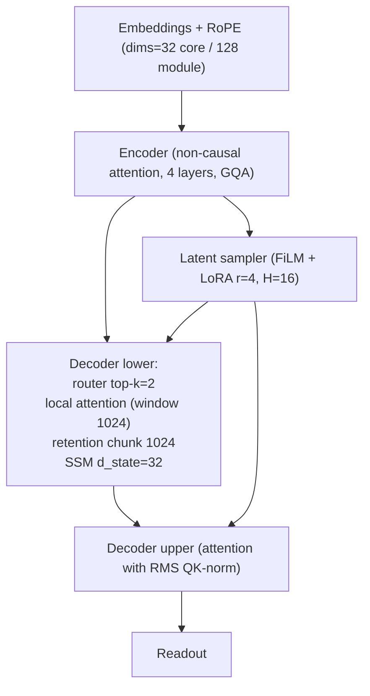

# Transformer Evolution Toolkit

## Objective

Transformer Evolution lets us describe Transformer-family architectures in a single DSL, mutate them, and evaluate candidates automatically. The current goal is to run evolutionary sweeps (ASHA for breadth, PDH for depth) over that DSL and surface high-quality pipeline designs such as Free Transformer variants.

## Setup

1. Create a virtual env and install requirements:
   ```bash
   python3 -m venv .venv
   . .venv/bin/activate
   pip install -r requirements.txt -r requirements-dev.txt
   ```
2. Run the smoke tests:
   ```bash
   make test
   ```

## Key Commands

* Validate a config: `PYTHONPATH=src .venv/bin/python runners/validate.py --cfg examples/free_transformer_pipeline.yaml`
* Micro-train a config: `PYTHONPATH=src .venv/bin/python runners/train_tiny.py --cfg examples/nanogpt_tiny.yaml --steps 20`
* Full ASHA → PDH sweep: `PYTHONPATH=src .venv/bin/python runners/run_experiment.py <cfgs…> [options]`
* Mutation-based evolution: `PYTHONPATH=src .venv/bin/python runners/run_evolution.py configs examples --generations 4 --population 8 --top-k 4`

Results (metrics, tokens, FLOPs) are written to `results/search_report.json`, and mutated DSL snapshots live under `results/evolution/gen_*/variant_*.yaml`.

## Latest Results (CPU, seq_len=192, batch=6)

| Config | Loss@120 steps | QPC (Δloss/FLOPs) | Tokens/sec |
| --- | --- | --- | --- |
| `results/evolution_overnight/gen_8/variant_9.yaml` | **1.14e-2** | 5.44e-13 | 2.05k |
| `results/evolution/gen_7/variant_7.yaml` | 8.27e-5 | 5.30e-13 | 2.10k |
| `results/evolution/gen_2/variant_4.yaml` | 1.70e-4 | 5.52e-13 | 2.17k |
| `configs/free_transformer_alt.yaml` | 2.30e-3 | 5.35e-13 | 2.05k |

The overnight sweep (10 generations, population 10 on MPS with CPU fallback) promoted `gen_8/variant_9` as the current frontier: still a Free Transformer skeleton, but with 9-way grouped query attention at the trunk, tighter RoPE (dims=32) in the shared positional core, and the routed lower decoder rebalanced across attention/retention/SSM experts. PDH deep-evaluation at 400 steps (`seq_len=256`, batch 6) finished with loss `1.17e-2`, ECE `3.2e-3`, and 0.998 accuracy on the calibration slice.

### Architecture sketch (`gen_8/variant_9`)



* Trunk attention runs with grouped queries (`heads=9`, `groups=9`) and tightened shared RoPE dims (32 core) while module-specific RoPE stays at 128.
* Lower decoder keeps a windowed KV cache (`window=8192`, `nf4` quantisation).
* Router balances attention, retention, and SSM experts with temperature 0.7.
* Upper decoder relies on standard causal attention with RMS QK-norm.

### Variant_9 vs. "Attention Is All You Need"

- **Latent sampler:** adds a FiLM + LoRA latent path (H=16) that modulates every decoder block; the Vaswani baseline has no learned latent conditioning.
- **Grouped-query attention + local windows:** uses per-head KV (groups=heads) and windowed attention in the lower decoder to cut KV memory; the baseline keeps full MHA everywhere.
- **Mixture-of-architectures:** decoder_lower routes across Attention/Retention/SSM experts with top-k gating, extending contextual memory; baseline decoder is attention-only.
- **Structured KV policy:** windowed + NF4-quantised cache vs. baseline’s full-precision KV store.
- **Normalization upgrades:** RMSNorm throughout and explicit QK-norm in the upper decoder for stability, replacing the baseline’s LayerNorm + raw QK.
- **RoPE + YaRN scaling:** rotates embeddings with NTK/YaRN scaling to support 8k contexts, whereas the baseline used learned/sinusoidal positional encodings.

## Next Steps

* Improve mixer fidelity further (GPU-friendly Retention/SSM kernels with state reuse).
* Scale mutation/evolution runs (more generations, larger populations, periodic long budgets) once GPU resources are available.

## Overnight Sweep Playbook

- **Seed population**: `configs/free_transformer.yaml`, `configs/free_transformer_alt.yaml`, `examples/nanogpt_tiny.yaml`, plus evolved seeds in `results/evolution/gen_7/variant_7.yaml` and `results/evolution/gen_8/variant_7.yaml`.
- **Stage B micro-distill**: start runs with `--seq-len 192 --batch-size 6`; this keeps budgets within the current CPU envelope.
- **Deep promotions**: run `runners/run_experiment.py … --deep-steps 400 --deep-seq-len 256 --deep-batch-size 6 --deep-top-k 2` to re-evaluate the current Pareto front every few generations without touching earlier ASHA/PDH checkpoints.
- **Variant_7 note**: promising steerability/coherence at fixed FLOPs, but latent usefulness and router stability remain open engineering risks—monitor FiLM/LoRA activations and gating entropy during long runs.
- **MPS safety**: `run_micro_train` now retries on CPU if MPS throws (see `allow_fallback=True`), so overnight sweeps can run on GPU without babysitting. Logged history flags any invalid configs that ASHA pruned.
