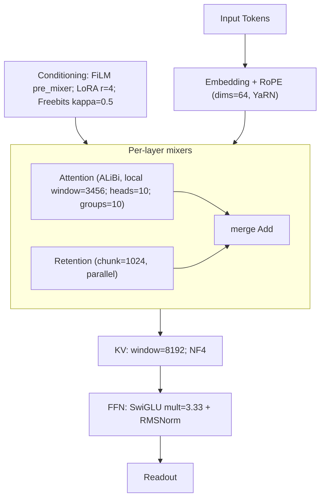
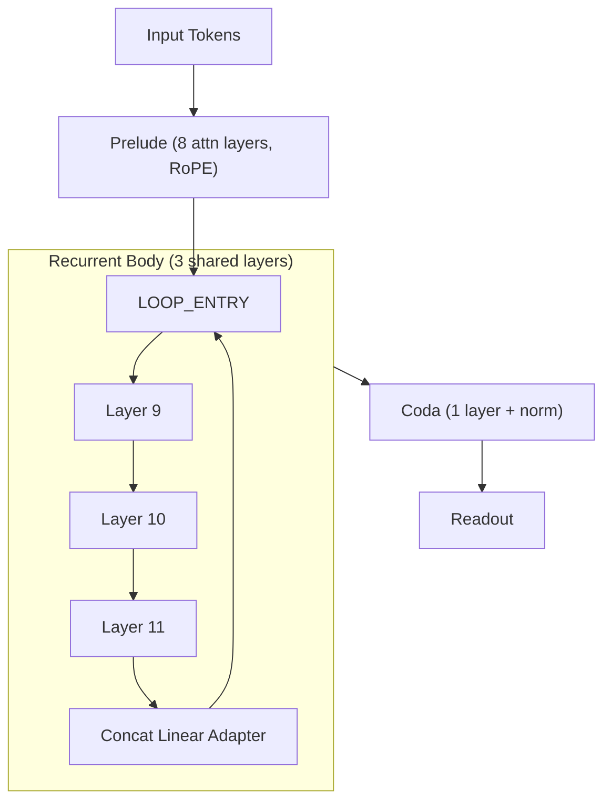

# Transformer Evolution
[](https://deepwiki.com/strangeloopcanon/transformer-evolution)

Question: can we "evolve" transformers to find a better architecture?

A toolkit for defining, evolving, and evaluating Transformer-family architectures using a flexible Domain-Specific Language (DSL).

This project lets you explore the architectural search space through evolutionary algorithms, surfacing high‑quality designs by mutating, crossing over, and evaluating candidates automatically.


## What we tried and what we found

- Goal: push beyond hyper‑parameters and explore macro‑architecture. Make search compute‑aware.
- Method: Built a fully typed DSL to represent all manner of transformers (and related) architectures. Then used ASHA (breadth) + PDH (depth) with novelty‑aware parents, optional crossover, and radical macro‑mutations (stencil/position/hierarchy/depth‑router/KV policy/mixer topology/conditioning).
- Findings: the search consistently favored two strong families:
  - Deep sliding‑window trunk + hierarchical downsampling + token‑level depth routing (efficient compute; dynamic depth when tokens are “easy”).
  - Parallel Attention+Retention per layer with ALiBi/YaRN where helpful, plus windowed NF4 KV cache and FiLM/LoRA conditioning (good long‑context behavior under bounded memory).
- Common upgrades across winners: RMSNorm + SwiGLU, RoPE (often small dims≈32 with scaling), grouped/efficient attention, local/sliding windows, KV windowing + quantization.
- Reproducibility: every run writes a lineage (JSON + Mermaid). See the compact final branches in [docs/lineage_focus.png](docs/lineage_focus.png) (data: [docs/lineage_focus.json](docs/lineage_focus.json)) and the idea map in [docs/transformer_subway.png](docs/transformer_subway.png). A snapshot of recent runs lives at [docs/results_index.json](docs/results_index.json).

## Key Features

- **Flexible DSL:** Define a wide range of Transformer-family architectures in a single, typed, and validated DSL.
- **Powerful Search Drivers:** Utilizes a combination of ASHA (for breadth), PDH (for depth), and novelty-aware evolutionary algorithms.
- **Advanced Mutations:** Supports both simple hyperparameter tuning and radical, macro-level architectural changes.
- **Rich Outputs:** Generates YAML snapshots, performance metrics, and lineage visualizations for each run.
- **Reproducible Results:** Track every candidate and its ancestry, ensuring full transparency and reproducibility.
- **Depth Recurrence Primitive:** Split any stack (core or pipeline module) into prelude/body/coda segments, loop the body with shared weights, and tune adapters/curricula directly from the DSL.

---

## Getting Started

### 1. Prerequisites

- Python 3.9+ (tested on 3.9–3.12)

### 2. Installation

Create a virtual environment and install the required dependencies.

```bash
python3 -m venv .venv
source .venv/bin/activate
pip install -r requirements.txt -r requirements-dev.txt
```

### 3. Run a Quick Test

Verify your setup by running the smoke tests.

```bash
make test
```

### 4. Run a Sample Evolution

Start a small-scale evolutionary search. This command seeds the initial population from the example configurations and runs for a few generations.

```bash
PYTHONPATH=src python runners/run_evolution.py \
  configs examples \
  --output results/evolution_explore_quick \
  --generations 10 --population 12 --top-k 4 --immigrants 4 \
  --device mps --seq-len 192 --batch-size 6 \
  --asha-min 40 --asha-max 160 --asha-reduction 2
```

---

## Usage

### Running Experiments

- **Evolutionary Search:** The primary method for discovering new architectures.
  ```bash
  PYTHONPATH=src python runners/run_evolution.py <seed_dirs...> [options]
  ```
  - Use `configs/recurrence_stack.yaml` (core recurrence) or `examples/pipeline_recurrence.yaml` (module-level recurrence) as ready-made seeds.
  - To continue from previous best runs, add `--top-count 4` (optionally point `--top-index` elsewhere) and the driver will pull up to four `top_candidates` from `docs/results_index.json`.
- **Full Sweep (ASHA → PDH):** Evaluate a fixed set of configurations.
  ```bash
  PYTHONPATH=src python runners/run_experiment.py <config_files...> [options]
  ```
- **Validate a Config:** Check a single architecture file for correctness.
  ```bash
  PYTHONPATH=src python runners/validate.py --cfg examples/plain.yaml
  ```
- **Micro-Train a Config:** Train a tiny model for a few steps.
  ```bash
  PYTHONPATH=src python runners/train_tiny.py --cfg examples/nanogpt_tiny.yaml --steps 20
  ```

### Run Recipes

- **Explore (Wild Structure Changes):** Use a high probability of macro-mutations and more immigrants to diversify the population.
  ```bash
  --macro-prob 0.6 --immigrants 5
  ```
- **Exploit (Refine Winners):** Lower the mutation probability and focus on the top-performing candidates.
  ```bash
  --macro-prob 0.15 --top-k 8
  ```
  
Tip: `make help` lists useful maintenance commands (lineage/index).

---

## Project Insights & Results

This project tracks the lineage of architectural changes and their impact on performance.

### Architectural Subway Map

The "subway map" illustrates how core ideas composed into winning candidates over generations.


-   **Norm/FFN:** RMSNorm + SwiGLU replace LayerNorm + ReLU/GeLU.
-   **Position:** RoPE (sometimes with YaRN scaling) or ALiBi where local bias helps.
-   **Mixer:** Full → Local → Sliding attention; hybrid lines (Retention/SSM) appear in runner‑ups.
-   **KV:** Windowed caches and quantization bound memory for long contexts.
-   **Depth & structure:** hierarchy + token‑level depth routing; parallel mixers in runner‑ups.
-   **Conditioning:** FiLM + LoRA + Freebits appear in the modulated path.

### Current Standouts

- See the latest top candidates in `docs/results_index.json` (snapshot) or `results/index.json` (live). The `top_candidates` list under each run contains the best paths, with scores logged at the end of each run.
- **Latest recurrence-focused run (`results/evolution_recurrence_long`, 20 generations, Nov 2025):**
  - `gen_10/variant_9.yaml` (score ≈ 0.0356). 512-d route stack with local attention (512 window), retention, and SSM plus two-level hierarchy. It dropped recurrence entirely, reinforcing that latent depth must earn its FLOPs to persist.
  - `gen_10/immigrant_1.yaml`. 640-d router combining attention/retention/SSM, FiLM + LoRA + Freebits conditioning, FP8 windowed KV, and a token-level depth router—our strongest long-context baseline for 8k tokens.
  - `gen_16/variant_7.yaml`. Only top-five model that kept the recurrence primitive (prelude 8 / body 3 / coda 1 with concat-linear adapter). Loops collapsed to 1 during evolution, a surprising signal that we need to bias future runs so recurrent unrolls stay >1 until they prove useless.

### Evolved Architecture (current winner)

A simplified block‑level sketch of the current top candidate (see the path under `top_candidates` in [docs/results_index.json](docs/results_index.json)):



- Parallel Attention+Retention per layer balances local inductive bias (ALiBi + long window) with long‑range memory (retention chunk≈1024).
- FiLM + low‑rank Q modulation (LoRA r=4) provide light‑weight conditioning; Freebits regularization prevents collapse.
- Windowed + quantized KV (NF4) bounds memory while maintaining 8k contexts.
- RMSNorm + SwiGLU and small‑dim RoPE with scaling are consistent across winners.

#### Latent Recurrence Variant

The latest run also surfaced a structural recurrence candidate (`results/evolution_recurrence_long/gen_16/variant_7.yaml`). Although evolution collapsed its loop count to 1 (surprising evidence that recurrence must justify its FLOPs), the architecture still showcases how the new DSL primitive stitches prelude/body/coda segments together:



- Prelude carries most of the depth; the 3-layer recurrent block is shared and re-enters via a concat-linear adapter (noise off in this specimen).
- Because loops fell back to 1, compute stayed cheap—but future runs can bias mutations so this block keeps >1 iterations long enough to prove its worth.

<!-- legacy diagram removed for clarity -->

---

<details>
<summary><b>Development & Maintenance</b></summary>

### Visualize Lineage

Each run produces a `lineage.json`. You can visualize the full evolutionary history using `make`. This updates `docs/lineage_focus.png`.
Note: Mermaid rendering via `mmdc` is optional; Node ≥20 is recommended.

```bash
# Generate from the latest run
make lineage

# Or specify a run directory
make lineage RUN=results/<run_dir> K=3
```

### Index Results

The `make index` command inventories all runs and creates a summary at `results/index.json` (and a snapshot at `docs/results_index.json`).

```bash
make index
```

### Prune Results

Archive non-essential YAML files from a run to save space. This is a safe, non-destructive operation.

```bash
# Dry-run to see what would be archived
python scripts/prune_results.py results/<run_dir>

# Apply the pruning
python scripts/prune_results.py results/<run_dir> --apply
```

</details>
