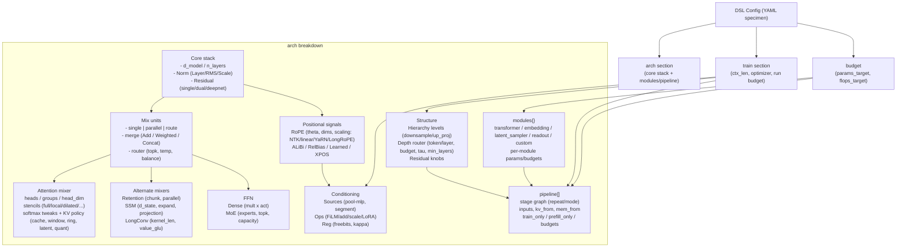

# DSL Capability Map

This note turns the DSL in `src/evoforge/dsl/` into a single, GitHub-friendly visual so you can show at a glance what a config covers.

## DSL at a Glance

- Start from `arch`: choose the core stack, give it mixers (attention, retention, SSM, long conv), FFNs, positional encodings, conditioning, and structural knobs such as hierarchy or depth routing.
- Add optional `modules{}` for embeddings, latent samplers, readouts, or extra transformer stacks, then wire them via `pipeline[]` with explicit stage modes, repeats, and memory/KV routing.
- The `train` block anchors optimizer assumptions (ctx length, lr, wd, betas, clip, dtype) plus per-run budgets, while the top-level `budget` sets global params/flops targets that guide search and pruning.

## Rendering Notes

- GitHub, VS Code, Obsidian, and most Markdown previewers render Mermaid blocks inline.  
- To export a static asset, copy the diagram into a `.mmd` file and run `npx @mermaid-js/mermaid-cli -i <file>.mmd -o <file>.png`.
